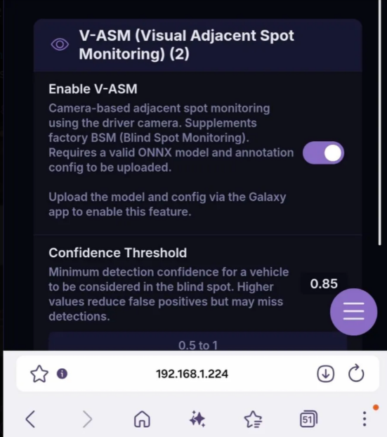

# Vision-ASM Route Submission

Open-source **Vision-Adjacent Spot Monitoring (ASM)** model training tool for Comma routes.

Vision-ASM uses the driver-facing wide-angle camera to detect vehicles in adjacent lanes through the side windows, improving blind-spot awareness across different vehicles and environments.

## What is Vision-ASM?

Vision-ASM aims to provide a community-built visual blind-spot monitoring system.

Use cases:

* **Vehicles without BSM:** Provides a vision-only "adjacent-spot" alert system.
* **Vehicles with factory BSM:** Works alongside radar-based systems to provide additional visual awareness, including vehicles that may be too far ahead (adjacent to you) to trigger factory sensors.

The current model has been trained on routes from a single vehicle and performs well, but requires diverse data from different vehicle interiors, cameras, and driving environments.

## Submit Data

### Google Colab Upload Utility (Recommended)

The utility simplifies route submission by automatically handling route selection, file verification, and upload requests.

Requires:

* Google account (only for running Colab)
* Comma JWT token
* Dongle ID

[Run Colab Utility](https://colab.research.google.com/drive/1YmdxznB9cSIzj-ngIbW-rpv2C-QbJtAW)

The utility:

* Authenticates directly with Comma APIs using your JWT token.
* Lets you select routes from your device.
* Uploads only required training assets:
  * Driver camera footage
  * Log files
* Sets route visibility for training ingestion.
* Registers submitted routes for Vision-ASM dataset tracking.

Your JWT token is never sent anywhere except Comma APIs. The tool runs entirely inside your own Google Colab session.

### Manual Submission

[Submit Routes](https://forms.gle/NCC1eQ38B62icg5a8)

Useful routes:

* Vehicles beside your car
* Highway driving
* Lane changes
* Dense traffic
* Different weather and lighting conditions

Submitted data is used only for Vision-ASM development. The final model will be open-source.

## Privacy & Data Handling

Only the following information is shared:

* Route (dcam + logs which contain BSM radar data)
* Optional contact information provided during submission

Data is used for semi-automated fine-tuning of open-source computer vision models.

If your vehicle has factory BSM, those signals will be used in an automated process to help label adjacent vehicles.

## Demo

### Vision-ASM Detection Preview

### Settings Integration Preview

## Training Pipeline

1. **Extraction & Labeling**

   * Extracts driver camera frames using configurable windshield masks.
   * Uses manual annotations and YOLO assistance for vehicle labels.

2. **Dataset Balancing**

   Balances conditions including:

   * Day / Night
   * Highway / Local roads
   * Different vehicles and interiors
   * Various driving environments

3. **Model Training**

   Current experiments include:

   * **YOLOv8:** Vehicle detection (50 epochs)
   * **MobileNetV3:** Car / No-Car classification (15 epochs)

4. **Evaluation**

   Compares models to determine the best approach for reliable adjacent vehicle detection.

## Development

Feature development:
https://github.com/prabhaavp/openpilot/

## Credits

Inspired by:

* StarPilot  
  https://github.com/firestar5683/StarPilot

* Vision Speed Limit Training Workflow  
  https://github.com/firestar5683/StarPilot/blob/Dom/docs/speed-limit-vision-training.md

* JWT Authentication Concepts  
  https://github.com/nelsonjchen/op-dm-reading-tool

Thank you to these projects for providing examples of community-driven open-source vision model development.
